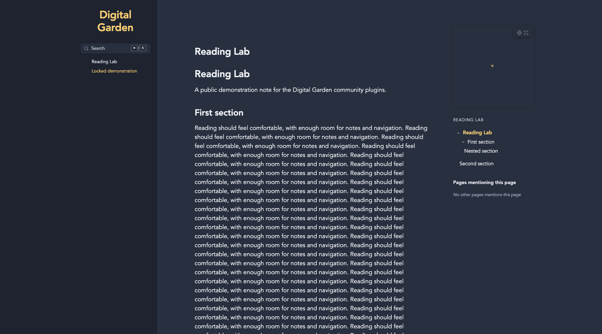

# TOC Settings

Simple TOC presentation presets, collapsible branches and automatic following of the core active heading.

## Installation

In Obsidian: Settings > Digital Garden > Plugins > Manage plugins > Browse & install. Until listed in the community gallery, use Install from GitHub with `koltensaccount/garden-plugin-toc-settings`. A garden with current plugin support is required. Installation is file copying only; no setup scripts or dependencies need to run on the garden. Save settings and let the site rebuild.

## Usage

Choose text size, spacing, list height, heading depth and title visibility in the garden manager. Branch buttons are keyboard accessible. Core Digital Garden owns active-heading tracking; this plugin observes that state. Bottom sheets keep the core height behavior. Folded targets remain navigable when Heading Folding is installed.

## Settings

| Key | Setting | Default |
| --- | --- | --- |
| `textSize` | Text size | "Medium" |
| `noteSpacing` | Space beside the note | "Comfortable" |
| `headingSpacing` | Space between headings | "Comfortable" |
| `listHeight` | List height | "Medium" |
| `detail` | Headings to show | "All headings" |
| `showTitle` | Show note name | true |
| `highlightActive` | Highlight where I am | true |
| `collapsible` | Collapsible TOC branches | true |
| `followActive` | Keep current heading visible | true |

## Compatibility and Accessibility

Works alone and with the other reading plugins. Shared footer controls use the neutral `dg-nav-tools` convention, with a floating fallback when navigation is absent. Each plugin ships the helper it needs; none imports another plugin. Current Digital Garden uses full-document navigation. Initialization is idempotent. Native controls, accessible labels, focus outlines and appropriate ARIA states are retained. Print styles remain separate from screen preferences. Browser storage failures fall back safely.

## Development

Node 22+; `npm ci`, `npm run check`, `npm test`. Tests use Node's test runner and Playwright's driver with an installed Chrome/Edge browser (`CHROME_PATH` overrides discovery). CI uses Ubuntu's Chrome. Browser tests never invoke an OS print dialog. The plugin files are ready to copy directly into `src/plugins/toc-settings/` in a current test garden. Real upstream integration and combination checks are reported in `VALIDATION.md`.

## License

MIT, copyright 2026 Kolten Bendickson.
